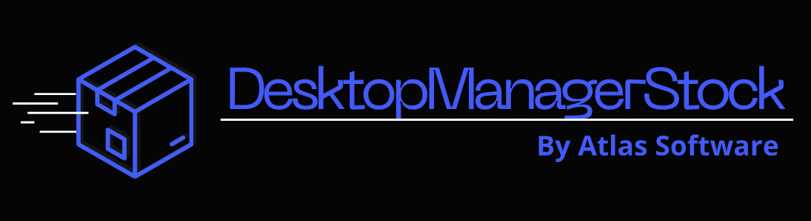
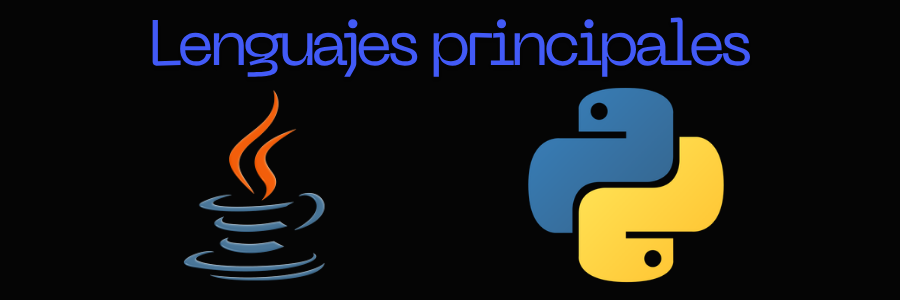
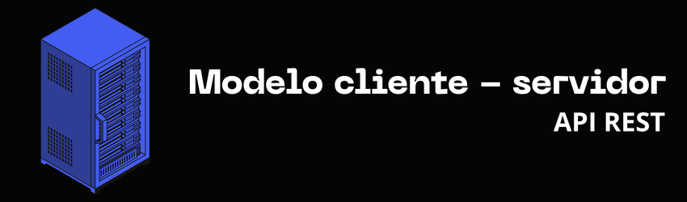

<h1 align="center">
  
</h1>

  
  
  
  
  

<!-- Sistema de Stock -->

  

  <b>Sistema de gestión de inventario y stock para escritorio</b> 
  desarrollado con <b>Python</b> (backend API) + <b>.NET 10</b> (frontend Windows Forms).

<!-- Lenguajes -->
<h2 align="center">Lenguajes utilizados</h2>

  

<!-- Características implementadas -->
<h2>✅ Características (implementadas)</h2>

<ul>
  <li>✅ Gestión de productos (alta, baja, modificación)</li>
  <li>✅ Control de stock mínimo y máximo</li>
  <li>✅ Alertas de stock bajo</li>
  <li>✅ Autenticación segura con JWT y roles (admin, editor, lector)</li>
  <li>✅ Validaciones de seguridad: registro forzado a rol "lector", cantidad positiva, respeto de stock máximo</li>
  <li>✅ Paginación en listado de productos</li>
  <li>✅ Índices en base de datos para consultas rápidas</li>
  <li>✅ Documentación interactiva automática en /docs</li>
  <li>✅ <strong>Historial de movimientos de stock</strong> (auditoría de entradas/salidas)</li>
  <li>✅ <strong>Reportes en PDF y Excel</strong> (productos, stock bajo, movimientos)</li>
  <li>✅ Rate limiting en login y registro (protección contra fuerza bruta)</li>
  <li>✅ Logging estructurado de eventos de seguridad y operaciones críticas</li>
  <li>✅ Validación de contraseña fuerte (mayúscula, número, carácter especial)</li>
  <li>✅ Tests unitarios y de integración (41 tests, 100% de funcionalidades cubiertas)</li>
</ul>

<!-- Próximas características (en desarrollo) -->
<h2>⏳ Próximas características (en desarrollo)</h2>

<ul>
  <li>⏳ Refresh tokens para sesiones más largas sin re-login</li>
  <li>⏳ Reportes avanzados (gráficos, resúmenes mensuales)</li>
  <li>⏳ Integración con frontend .NET (ya en desarrollo)</li>
</ul>

<!-- Cartel de API REST -->

  

<!-- Tecnologías en tabla -->
<h2>🛠️ Tecnologías utilizadas</h2>

<table>
  <tr>
    <td valign="top" width="33%">
      <h3>🐍 Backend (Python)</h3>
      <ul>
        <li>Python 3.11+</li>
        <li>FastAPI</li>
        <li>SQLAlchemy</li>
        <li>SQLite</li>
        <li>ReportLab (PDF)</li>
        <li>OpenPyXL (Excel)</li>
      </ul>
    </td>
    <td valign="top" width="33%">
      <h3>🖥️ Frontend (.NET 10)</h3>
      <ul>
        <li>.NET 10</li>
        <li>Windows Forms</li>
        <li>HttpClient (consumo de API)</li>
      </ul>
    </td>
    <td valign="top" width="33%">
      <h3>🔧 Herramientas</h3>
      <ul>
        <li>Git & GitHub</li>
        <li>Visual Studio 2022</li>
        <li>FastAPI /docs</li>
        <li>Docker (opcional)</li>
        <li>pytest / coverage</li>
      </ul>
    </td>
   </tr>
</table>

<!-- Requisitos e instalación -->
<h2>📋 Requisitos previos</h2>

<ul>
  <li>Python 3.11+</li>
  <li>.NET 10 SDK (para compilar el frontend)</li>
  <li>SQLite3</li>
  <li>Git (opcional)</li>
</ul>

<h2>📥 Instalación y configuración</h2>

<pre>
<code>git clone https://github.com/MauroKpoxD/DesktopManagerStock.git
cd DesktopManagerStock</code>
</pre>

<h2>💻 Ejecución local</h2>

<h3>Backend (API)</h3>
<pre>
<code>cd backend-python
pip install -r requirements.txt
uvicorn main:app --reload
# La API corre en http://localhost:8000
# Documentación interactiva: http://localhost:8000/docs</code>
</pre>

<h3>Frontend (Cliente .NET Windows Forms)</h3>
<pre>
<code>cd frontend-dotnet
dotnet build
dotnet run --project DesktopStock.csproj</code>
# O abre la solución en Visual Studio 2022 y ejecuta.
</pre>

<h2>⚙️ Configuración</h2>

Crea un archivo <code>.env</code> en la carpeta <code>backend-python/</code> (puedes copiar de <code>.env.example</code>):

<pre>
<code># Generar una SECRET_KEY con: python -c "import secrets; print(secrets.token_urlsafe(32))"
SECRET_KEY=tu_clave_secreta_aqui
ALGORITHM=HS256
ACCESS_TOKEN_EXPIRE_MINUTES=30

# Base de datos
DATABASE_URL=sqlite:///./stock.db
DB_ECHO=False
RUN_SEEDER=false

# API
API_HOST=127.0.0.1
API_PORT=8000
API_RELOAD=true
API_VERSION=0.2.0

# Stock
STOCK_ALERT_THRESHOLD=5

# CORS
CORS_ORIGINS=http://localhost:3000

# Rate limiting
RATE_LIMIT_ENABLED=true
LOGIN_RATE_LIMIT=5/minute
REGISTER_RATE_LIMIT=2/minute

# Entorno
ENVIRONMENT=production
</code>
</pre>

<h2>🧪 Tests</h2>

Para ejecutar la suite de pruebas:

<pre>
<code>pytest tests/ -v</code>
</pre>

Resultado actual: <strong>41 passed, 1 skipped, 2 warnings</strong> (cobertura completa de funcionalidades críticas).

<h2>📡 Documentación de la API</h2>

La documentación completa de la API REST (endpoints, autenticación, esquemas, ejemplos) se encuentra en el archivo:

  <a href="docs/API_DOCS.md"><strong>📘 docs/API_DOCS.md</strong></a>

Además, una vez que el backend esté corriendo, puedes explorar la documentación interactiva generada automáticamente por FastAPI:

<ul>
  <li><strong>Swagger UI</strong>: <a href="http://localhost:8000/docs">http://localhost:8000/docs</a></li>
  <li><strong>ReDoc</strong>: <a href="http://localhost:8000/redoc">http://localhost:8000/redoc</a></li>
</ul>

<h2>🤝 Contribuir</h2>

<ol>
  <li>Fork el proyecto</li>
  <li>Crea tu rama (<code>git checkout -b feature/nueva-funcionalidad</code>)</li>
  <li>Commit tus cambios</li>
  <li>Push a la rama</li>
  <li>Abre un Pull Request</li>
</ol>

<h2>📄 Licencia</h2>

<b>APACHE 2.0</b> - ver archivo <a href="LICENSE">LICENSE</a>

