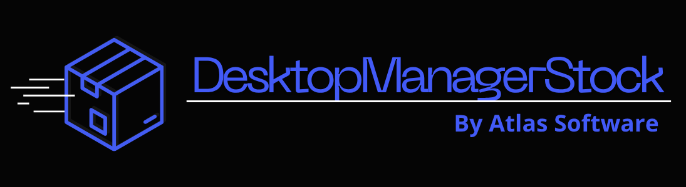
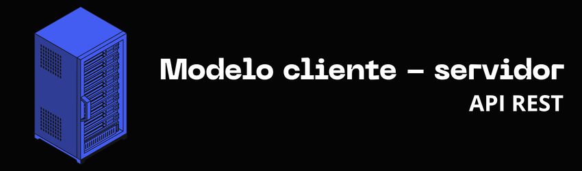

<h1 align="center">
  
</h1>

  
  
  
  
  
  

<!-- Sistema de Stock -->

  

  <b>Sistema de gestión de inventario y stock para escritorio</b> 
  desarrollado con <b>Python</b> (backend API) + <b>.NET MAUI</b> (frontend multiplataforma).

<!-- Separador decorativo -->

<!-- Tecnologías y lenguajes -->
<h2 align="center">🚀 Tecnologías y lenguajes</h2>

  <strong>desarrollado con</strong> 
  
  <strong>+</strong>
  

 

  <table>
    <tr>
      <td align="center" width="120" style="border: none; padding: 10px;">
         
        <strong>Python</strong> 
        <small>Backend API</small>
      </td>
      <td align="center" width="120" style="border: none; padding: 10px;">
         
        <strong>HTML5</strong> 
        <small>Estructura</small>
      </td>
      <td align="center" width="120" style="border: none; padding: 10px;">
         
        <strong>CSS3</strong> 
        <small>Estilos</small>
      </td>
      <td align="center" width="120" style="border: none; padding: 10px;">
         
        <strong>C#</strong> 
        <small>.NET MAUI</small>
      </td>
      <td align="center" width="120" style="border: none; padding: 10px;">
         
        <strong>.NET MAUI</strong> 
        <small>Multiplataforma</small>
      </td>
      <td align="center" width="120" style="border: none; padding: 10px;">
         
        <strong>PostgreSQL</strong> 
        <small>Base de datos</small>
      </td>
      <td align="center" width="120" style="border: none; padding: 10px;">
         
        <strong>Docker</strong> 
        <small>Despliegue</small>
      </td>
    </tr>
  </table>

<!-- Características destacadas -->
<h2 align="center">✨ Características destacadas</h2>

<table align="center" style="width: 80%; border-collapse: collapse;">
  <tr>
    <td style="padding: 8px 15px; vertical-align: top; width: 50%;">
      <ul style="list-style: none; padding-left: 0;">
        <li><strong>📦 Gestión de productos</strong> <small>CRUD completo, stock mínimo/máximo, alertas de stock bajo</small></li>
        <li><strong>🔐 Autenticación JWT</strong> <small>Roles (admin/editor/lector) y refresh tokens</small></li>
        <li><strong>📊 Auditoría y reportes</strong> <small>Historial de movimientos, reportes PDF/Excel</small></li>
      </ul>
    </td>
    <td style="padding: 8px 15px; vertical-align: top; width: 50%;">
      <ul style="list-style: none; padding-left: 0;">
        <li><strong>🛡️ Seguridad</strong> <small>Rate limiting, contraseñas seguras, logging estructurado</small></li>
        <li><strong>🐘 PostgreSQL</strong> <small>Base de datos robusta y escalable</small></li>
        <li><strong>🐳 Docker + scripts</strong> <small>Despliegue automatizado (PowerShell/Bash)</small></li>
      </ul>
    </td>
  </tr>
</table>

<strong>🧪 42 tests</strong> &nbsp;|&nbsp; Cobertura completa ✅

<!-- En desarrollo -->
<h2 align="center">⏳ En desarrollo</h2>

  <table>
    <tr>
      <td align="center" width="200" style="padding: 15px;">
        <strong>📱</strong> 
        <strong>Frontend MAUI</strong> 
<<<<<<< HEAD
        <small>Windows, macOS, Linux, Android, iOS</small>
=======
        <small>Windows, macOS, Android, iOS</small>
>>>>>>> feature/interfaz-y-reconstruccion
      </td>
      <td align="center" width="200" style="padding: 15px;">
        <strong>📈</strong> 
        <strong>Dashboard</strong> 
        <small>Gráficos y estadísticas en tiempo real</small>
      </td>
      <td align="center" width="200" style="padding: 15px;">
        <strong>🔒</strong> 
        <strong>HTTPS</strong> 
        <small>Nginx-proxy-manager</small>
      </td>
    </tr>
  </table>

<!-- Cartel de API REST -->

  

<!-- Tecnologías en tabla -->
<h2>🛠️ Tecnologías utilizadas</h2>

<table>
  <tr>
    <td valign="top" width="33%">
      <h3>🐍 Backend (Python)</h3>
      <ul>
        <li>Python 3.11+</li>
        <li>FastAPI 0.136</li>
        <li>SQLAlchemy 2.0</li>
        <li>PostgreSQL (base de datos principal)</li>
        <li>ReportLab (PDF)</li>
        <li>OpenPyXL (Excel)</li>
        <li>python-jose (JWT)</li>
        <li>passlib (bcrypt)</li>
        <li>slowapi (rate limiting)</li>
      </ul>
    </td>
    <td valign="top" width="33%">
<<<<<<< HEAD
      <h3>📱 Frontend (.NET MAUI)</h3>
      <ul>
        <li>.NET MAUI 10</li>
        <li>Multiplataforma (Windows, macOS, Linux, Android, iOS)</li>
        <li>HttpClient (consumo de API)</li>
        <li>MVVM con Community Toolkit</li>
=======
      <h3>📱 Frontend (.NET MAUI Blazor Hybrid)</h3>
      <ul>
        <li>.NET MAUI 10 + Blazor Hybrid</li>
        <li>UI en Razor Components (HTML/CSS) + C#</li>
        <li>Multiplataforma (Windows, macOS, Android, iOS)</li>
        <li>HttpClient con renovación automática de token</li>
>>>>>>> feature/interfaz-y-reconstruccion
      </ul>
    </td>
    <td valign="top" width="33%">
      <h3>🔧 Herramientas</h3>
      <ul>
        <li>Git & GitHub</li>
        <li>Visual Studio 2022 / VS Code</li>
        <li>FastAPI /docs</li>
        <li>Docker & Docker Compose</li>
        <li>pytest / coverage</li>
        <li>PowerShell / Bash</li>
      </ul>
    </td>
   </tr>
</table>

<!-- Requisitos e instalación -->
<h2>📋 Requisitos previos</h2>

<ul>
  <li>Python 3.11+</li>
  <li>.NET MAUI 10 SDK (para compilar el frontend)</li>
  <li>PostgreSQL 15+ (local o en contenedor Docker)</li>
  <li>Git (opcional)</li>
  <li>Docker y Docker Compose (opcional, para despliegue)</li>
</ul>

<h2>📥 Instalación y configuración</h2>

<pre>
<code>git clone https://github.com/MauroKpoxD/DesktopManagerStock.git
cd DesktopManagerStock</code>
</pre>

<h2>💻 Ejecución local</h2>

<h3>Backend (API)</h3>
<pre>
<code>cd server
pip install -r requirements.txt
# Configurar .env (copiar de .env.example)
cp .env.example .env
# Editar .env con tus variables (ver sección de configuración)
python main.py
# La API corre en http://localhost:8000
# Documentación interactiva: http://localhost:8000/docs</code>
</pre>

<<<<<<< HEAD
<h3>Frontend (Cliente .NET MAUI) En desarrollo</h3>
<pre>
<code>cd client
dotnet build
dotnet run --project DesktopManagerStock.csproj</code>
</pre>

<del>O abre la solución en Visual Studio 2022 y ejecuta.</del> <strong>Esta sección está en desarrollo activo.</strong>

=======
<h3>Frontend (Cliente .NET MAUI Blazor Hybrid) Disponible</h3>
<pre>
<code>cd client
dotnet workload install maui   # una sola vez
dotnet restore
dotnet build -f net10.0-windows10.0.19041.0   # o net10.0-maccatalyst / net10.0-android / net10.0-ios
dotnet run -f net10.0-windows10.0.19041.0</code>
</pre>

UI en HTML/CSS (Razor Components) dentro de un <code>BlazorWebView</code> nativo — multiplataforma: Windows, macOS (Mac Catalyst), Android e iOS desde el mismo código. Ver <a href="client/README.md">client/README.md</a> para requisitos por plataforma, configuración de la URL de la API y notas sobre emuladores/dispositivos físicos.

>>>>>>> feature/interfaz-y-reconstruccion

<h2>🐳 Despliegue con Docker</h2>

<h3>Opción 1: Script automático (recomendado)</h3>
<pre>
<code>cd scripts
chmod +x deploy_api.sh
./deploy_api.sh</code>
</pre>

Este script instala dependencias, clona el repo, configura .env y levanta el contenedor automáticamente.

<h3>Opción 2: Manual</h3>
<pre>
<code>cd server
docker compose up -d --build
docker compose logs -f</code>
</pre>

<h3>Comandos útiles de Docker</h3>
<pre>
<code># Detener el contenedor
docker compose down

# Ver logs
docker compose logs -f

# Reconstruir después de cambios
docker compose up -d --build

# Ver estado
docker compose ps</code>
</pre>

<h2>📜 Scripts de automatización</h2>

El proyecto incluye scripts para facilitar el despliegue en diferentes sistemas:

<table>
  <tr>
    <th>Script</th>
    <th>Sistema</th>
    <th>Descripción</th>
  </tr>
  <tr>
    <td><code>scripts/deploy_api.sh</code></td>
    <td>Linux / macOS</td>
    <td>Despliegue completo con Docker (instala dependencias, clona, configura y levanta)</td>
  </tr>
  <tr>
    <td><code>scripts/levantar_servicio_python.bash</code></td>
    <td>Linux / macOS</td>
    <td>Levanta el servidor directamente sin Docker (modo desarrollo)</td>
  </tr>
  <tr>
    <td><code>scripts/levantar_docker.ps1</code></td>
    <td>Windows PowerShell</td>
    <td>Levanta el contenedor con docker-compose</td>
  </tr>
  <tr>
    <td><code>scripts/levantar_servicio.ps1</code></td>
    <td>Windows PowerShell</td>
    <td>Levanta el servidor directamente sin Docker (modo desarrollo)</td>
  </tr>
</table>

<h2>⚙️ Configuración</h2>

Crea un archivo <code>.env</code> en la carpeta <code>server/</code> (puedes copiar de <code>.env.example</code>):

<pre>
<code># Generar una SECRET_KEY con: python -c "import secrets; print(secrets.token_urlsafe(32))"
SECRET_KEY=tu_clave_secreta_aqui
ALGORITHM=HS256
ACCESS_TOKEN_EXPIRE_MINUTES=30

# Base de datos PostgreSQL
DB_HOST=localhost
DB_PORT=5432
DB_USER=postgres
DB_PASSWORD=tu_contraseña_sin_acentos
DB_NAME=desktopmanager
DB_ECHO=False
RUN_SEEDER=false

# API
API_HOST=127.0.0.1
API_PORT=8000
API_RELOAD=true
API_VERSION=0.3.2

# Stock
STOCK_ALERT_THRESHOLD=5

# CORS (para frontend)
CORS_ORIGINS=http://localhost:3000,http://localhost:8080

# Rate limiting
RATE_LIMIT_ENABLED=true
LOGIN_RATE_LIMIT=5/minute
REGISTER_RATE_LIMIT=2/minute

# Entorno (development / production)
ENVIRONMENT=production</code>
</pre>

<strong>Nota:</strong> Asegúrate de que la contraseña no contenga caracteres especiales como acentos o símbolos que puedan causar problemas de codificación en la URL de conexión.

<h2>🧪 Tests</h2>

Para ejecutar la suite de pruebas:

<pre>
<code>cd server
pytest tests/ -v</code>
</pre>

Resultado actual: <strong>42 passed, 1 skipped, 2 warnings</strong> (cobertura completa de funcionalidades críticas).

<h2>📡 Documentación de la API</h2>

La documentación completa de la API REST (endpoints, autenticación, esquemas, ejemplos) se encuentra en el archivo:

  <a href="docs/API_DOCS.md"><strong>📘 docs/API_DOCS.md</strong></a>

Además, una vez que el backend esté corriendo, puedes explorar la documentación interactiva generada automáticamente por FastAPI:

<ul>
  <li><strong>Swagger UI</strong>: <a href="http://localhost:8000/docs">http://localhost:8000/docs</a></li>
  <li><strong>ReDoc</strong>: <a href="http://localhost:8000/redoc">http://localhost:8000/redoc</a></li>
</ul>

<strong>Nota</strong>: En producción, se recomienda desactivar /docs para mayor seguridad.

<h2>🤝 Contribuir</h2>

<ol>
  <li>Fork el proyecto</li>
  <li>Crea tu rama (<code>git checkout -b feature/nueva-funcionalidad</code>)</li>
  <li>Commit tus cambios</li>
  <li>Push a la rama</li>
  <li>Abre un Pull Request</li>
</ol>

<h2>📄 Licencia</h2>

<b>APACHE 2.0</b> - ver archivo <a href="LICENSE">LICENSE</a>
